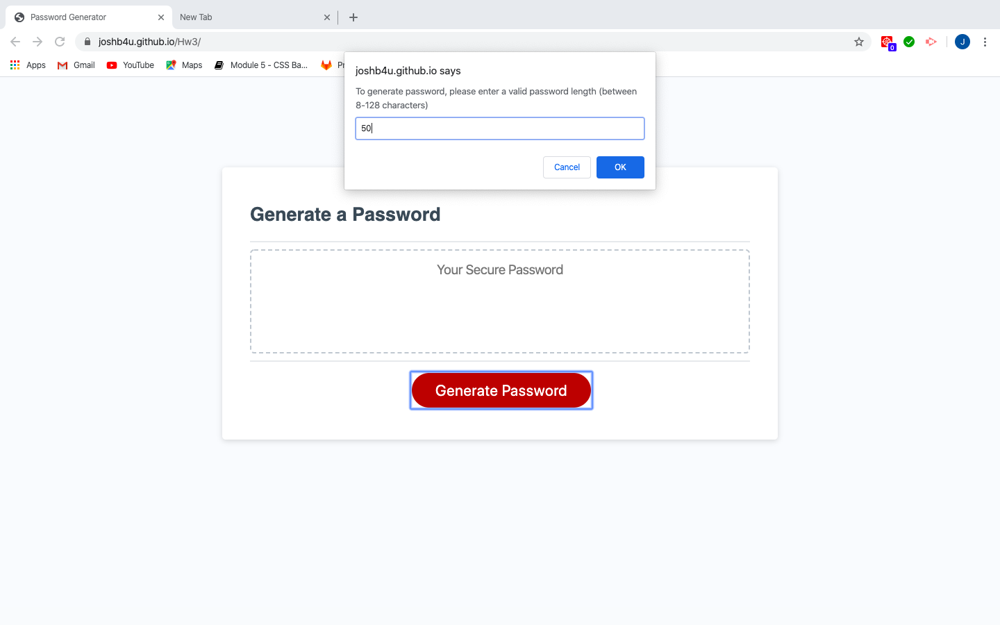
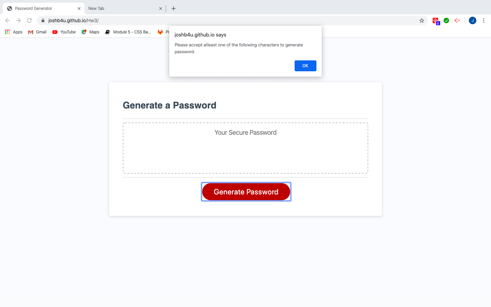
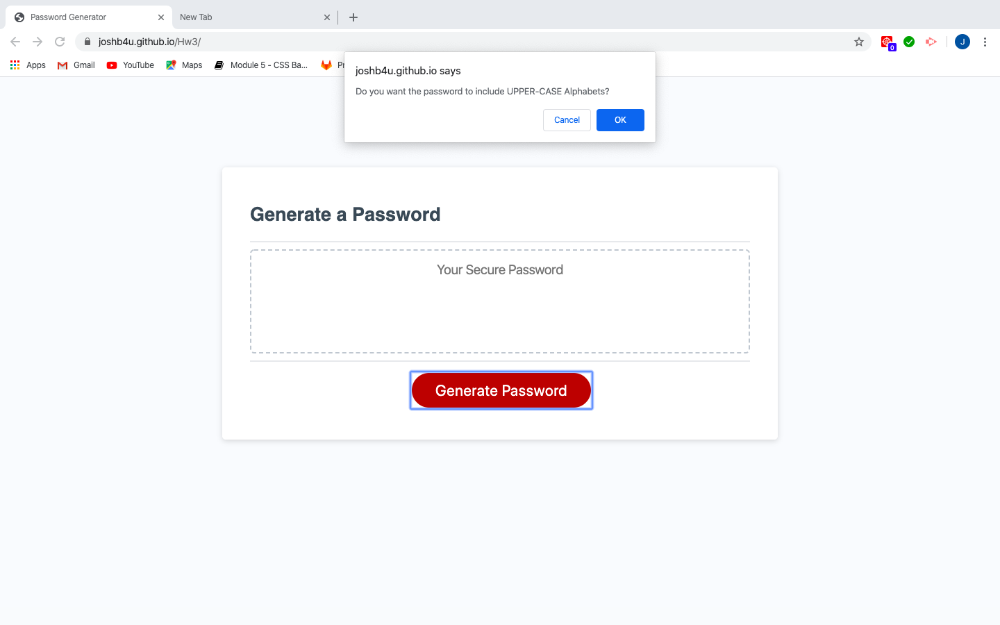
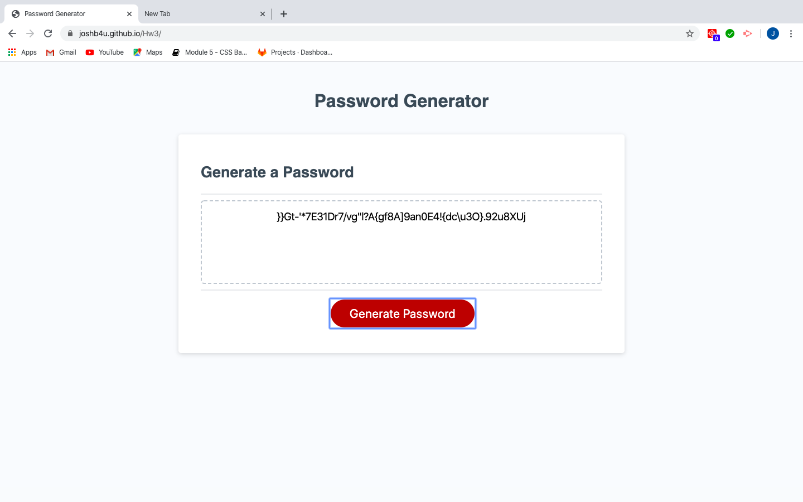

# 03 JavaScript: Password Generator

The Assignment was to create a password generator that can generate a password string ranging from 8 to 128 characters. The generator should also prompt whether the user wishes to include lower case alphabets, upper case alphabets, numbers and special characters. All the coding has been done Javascript file and the password generator has been successfully created. Snapshots below:

# PSEUDOCODE

1. Variables to be created for Password length, lower case and upper case alphabets, numbers and special characters.

2. A while loop is to be created for the user to input the correct password length. Only numbers from 8-128 will be accepted.

3. An alert and a while loop are to be created for the the user to accept atleast one of the upcoming properties for generating the password.

4. Lower case alphabets, Upper case alphabets, Numbers and Special characters are to be inputed to different variables.

5. All the above need to be inside a function.

6. Another function needs to be created for a password string to be initialized and based on the user's options, the above character properties are to be included in this string.

6. Now based on the password length, a random password needs to be generated from the password string and can be stored in another variable, say password output. This can be done inside a for loop and use Math.random property. The function should return the password output final value.

7. Last but not the least, all the character properties such as password length, lower case and upper case alphabets, numbers and special characters have to be reseted such that the process can be repeated multiple times.

Web URL: https://joshb4u.github.io/Hw3/